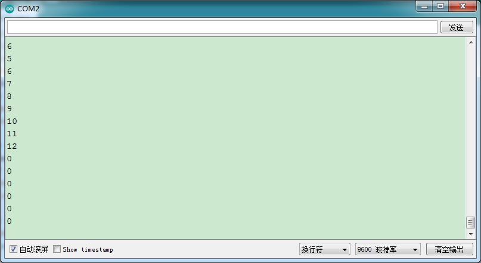

# Arduino


## 1. Arduino简介  

Arduino是一种开源电子原型平台，具有灵活的硬件和软件架构，适用于创建各种互动项目和电子艺术品。Arduino开发板可通过编程语言（如Arduino C/C++）进行编程，以便控制输入和输出设备、传感器、LED灯和电机等。Arduino的易用性和广泛的社区支持使其成为教育、DIY项目和快速原型开发的热门选择。用户可以利用丰富的库和示例代码，以降低学习门槛，快速实现创新想法。  

## 2. 接线图  

  

## 3. 测试代码（测试软件版本：arduino-1.8.12）  

```cpp  
#include <Encoder.h> // 导入编码器的库  

int item = 0;  
int old = 0;  
Encoder encoder(2, 3);  
int button = 4; // 按键的PIN  

void setup() {  
    Serial.begin(9600); // 设置波特率  
    pinMode(button, INPUT); // 按键为输入模式  
}  

void loop() {  
    item = encoder.read(); // 读取编码器的值赋给item  

    if (digitalRead(button) == 0) { // 如果按键按下  
        Serial.println(digitalRead(button)); // 打印按键值  
        delay(100);  
    }  

    if (old != item) { // 与之前读取的值不一样  
        Serial.println(item); // 打印编码器的值  
        old = item;  
    }  
}  
```  

## 4. 代码说明  

1. 在实验中，首先需要将编码器的库导入到 Arduino IDE 的库文件夹中，以确保代码能够正确编译。  

2. 代码中将CLK（时钟引脚）设置为2，将DAT（数据引脚）设置为3。该代码会在中断2被触发（CLK下降沿）时，读取数字口3（DAT）的电压值。若DAT电压为高电平，则旋转编码器的值加1；若DAT电压为低电平，则旋转编码器的值减1。  

3. 循环程序中，当按钮管脚（D4）为低电平时，打印当前按键值。  

## 5. 测试结果  

成功上传测试代码后，通过USB供电并打开串口监视器，设置波特率为9600。顺时针旋转编码器，显示数据减小；逆时针旋转编码器，显示数据增加；按下编码器中间按键，显示数据为0，如下图所示。  




