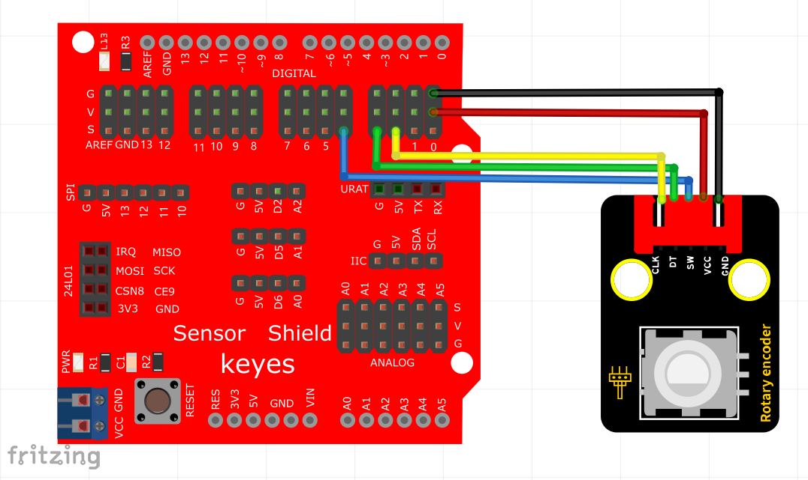

# KidsBlock

## 1. KidsBlock简介  

KidsBlock是一款面向儿童和初学者的编程和电子学习平台，通过可视化界面让用户体验编程的乐趣。该平台使用图形化编程模块，用户可以通过简单的拖放操作来创建逻辑代码，从而实现对硬件设备的控制。KidsBlock支持多种编程语言，包括Scratch和Arduino C，使得用户能够轻松创建各种项目，如传感器控制、灯光效果、机器人活动等。该平台不仅适合个人学习，也适合在学校和教育机构中作为编程教育的工具，帮助学生培养逻辑思维和创造力。  

## 2. 接线图  

  

## 3. 测试代码  

  

## 4. 代码说明  

1. 首先添加旋转编码器模块扩展，以确保编码器模块的功能正常工作。  

2. 定义三个整数变量，并启动串口波特率，设置波特率为9600。将CLK管脚设置为数字口2，DAT管脚设置为数字口3，计数变量item用于存储旋转编码器的值。编码器设置为在中断2（CLK）出现下降沿时读取DAT的电压，电压高时计数加1，低时减1。  

3. 设置按钮管脚为4，并将该值存储到定义的button变量中，以便对按钮状态进行监测。  

4. 在循环程序中，如果按钮管脚（D4）为低电平（即按下按钮），则将计数变量i的值清零，以实现重置功能。  

5. 上述代码块的编程方法在之前的实验中已有讲解，用户可以参考相关内容进行复习。  

## 5. 测试结果  

成功上传测试代码后，通过USB供电并观察串口监视器，顺时针旋转编码器，显示数据增加；逆时针旋转编码器，显示数据减小；按下编码器中间按键时，数据显示为0，如下图所示。  

