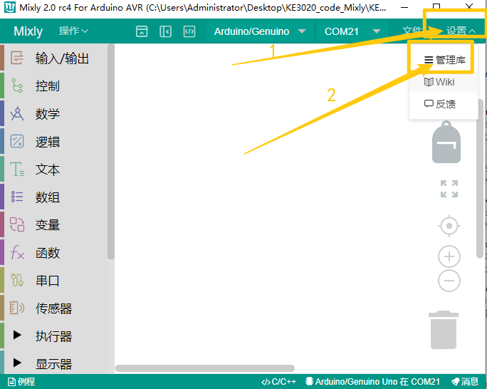
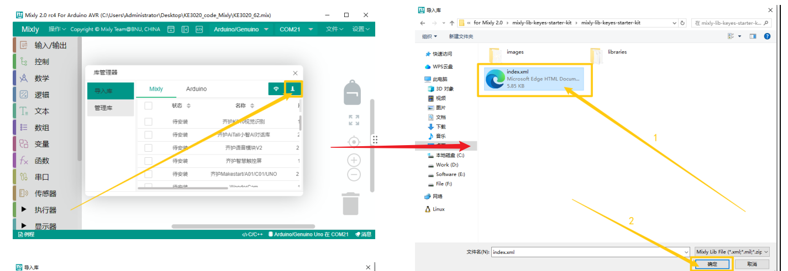

# Mixly

## 1. Mixly简介  

Mixly是一款基于图形化编程的开发环境，专为教育和初学者设计。它以可视化的方式让用户通过拖放代码块的形式来创建程序，从而降低了编程门槛。Mixly支持多种平台，包括Arduino和其他微控制器，使之适合各种项目的开发。用户可以通过简单的图形化界面控制硬件，学习编程和电子电路的基础。Mixly还提供了丰富的模块和示例，使得学习编程变得更加有趣和高效。  

## 2. 接线图  

  

## 3. 测试代码（测试软件版本：Mixly 1.2.0）

- 下载资料：[Mixly](./Mixly.7z)  

- 点击“设置”---->“管理库”。

  

- 选择本地导入，选择下载资源的库文件，选择库文件中的“.xml”后缀的文件导入。

  

  

## 4. 代码说明  

1. 首先导入库文件keyes sensor，在库keyes sensor下的“其他模块”单元找到并选择编码器模块。  

2. 将CLK管脚设置为数字口2，DAT管脚设置为数字口3，计数变量i会自动定义。该代码在库文件中设定了，在中断2（CLK）发生下降沿时，读取数字口3（DAT）的电压，当DAT电压为高时，旋转编码器的值加1；若DAT电压为低时，旋转编码器的值减1。这些设置可以在米思齐软件中查看对应的C语言代码。  

3. 在库keyes sensor下，选择编码器按钮，并把管脚设置为4，这个值被存储到定义的button变量中。  

4. 在循环程序中设置按钮管脚（D4）为低电平时，即按下按钮时，将计数变量i的值清0。  

5. 代码块的编程方法在之前的实验中已有讲解，用户可以回顾相关内容。  

## 5. 测试结果  

成功上传测试代码后，利用USB供电并打开串口监视器，设置波特率为9600。顺时针旋转编码器，数据显示增加；逆时针旋转编码器，数据显示减小；按下编码器中间按键，数据显示为0，如下图所示。  

