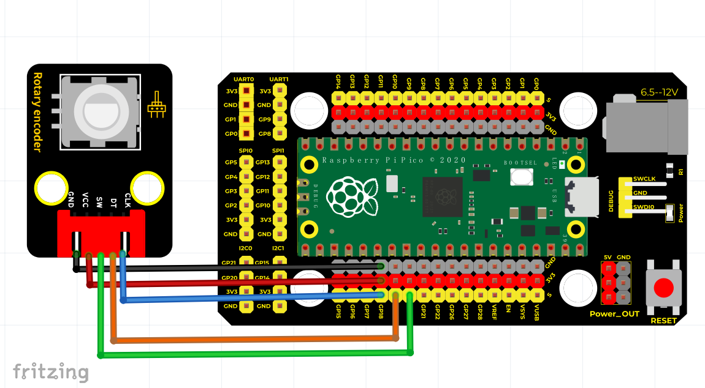
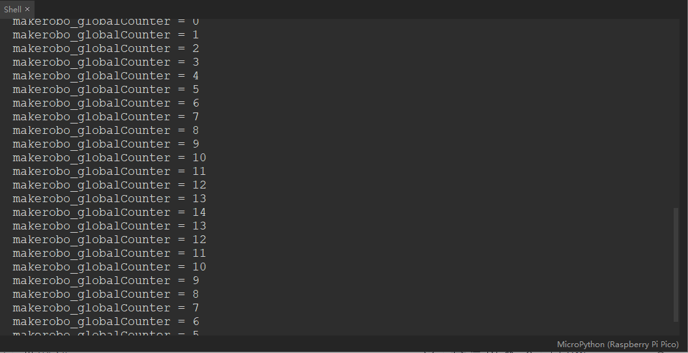

# Python


## 1. Python简介  

Python是一种高级、通用的编程语言，自1991年首次发布以来，因其简洁的语法、强大的库支持和广泛的应用场景而受到欢迎。Python支持多种编程范式，包括面向对象、过程式和函数式编程，使得开发者能够灵活选择最适合项目需求的编程风格。Python广泛应用于数据分析、机器学习、人工智能、Web开发、自动化脚本等领域。其丰富的第三方库（如NumPy、Pandas、Matplotlib等）和框架（如Django、Flask）极大地扩展了其功能，使得Python成为新手和专业开发人员的理想选择。  

## 2. 接线图  

  

| 节点          | 连接方式  |  
| -------------- | --------- |  
| 树莓派PICO    | 旋转编码器 |  
| GPIO 18       | CLK       |  
| GPIO 19       | DT        |  
| GPIO 20       | SW        |  

## 3. 测试代码（测试软件版本：Thonny 3.3.3）  

```python  
# －－－－Keyes－－－－  

#####################################################  

from machine import Pin  
from time import sleep  

makerobo_RoAPin = 18  # 旋转编码器CLK管脚  
makerobo_RoBPin = 19   # 旋转编码器DT管脚  
makerobo_BtnPin = 20   # 旋转编码器SW管脚  
makerobo_globalCounter = 0  # 计数器值  
makerobo_flag = 0  # 是否发生旋转标志位  
makerobo_Last_RoB_Status = 0  # DT 状态  
makerobo_Current_RoB_Status = 0  # CLK 状态  

# 初始化工作  
def makerobo_setup():  
    global clk_RoA  
    global dt_RoB  
    global sw_BtN  

    clk_RoA = Pin(makerobo_RoAPin, Pin.IN)  # 旋转编码器CLK管脚,设置为输入模式  
    dt_RoB = Pin(makerobo_RoBPin, Pin.IN)  # 旋转编码器DT管脚,设置为输入模式  
    sw_BtN = Pin(makerobo_BtnPin, Pin.IN, Pin.PULL_UP)  #设置管脚为输入模式，上拉至高电平(3.3V)  

    # 初始化中断  
    sw_BtN.irq(trigger=Pin.IRQ_FALLING, handler=makerobo_btnISR)  

# 旋转编码方向位判断函数  
def makerobo_rotaryDeal():  
    global makerobo_flag  # 是否发生旋转标志位  
    global makerobo_Last_RoB_Status  
    global makerobo_Current_RoB_Status  
    global makerobo_globalCounter  # 计数器值  

    makerobo_Last_RoB_Status = dt_RoB.value()  
    
    while(not clk_RoA.value()):  # 判断CLK管脚的电平变化来区分方向  
        makerobo_Current_RoB_Status = dt_RoB.value()  
        makerobo_flag = 1  # 发生旋转标记  
    
    if makerobo_flag == 1:  # 标记位为1 发生了旋转  
        makerobo_flag = 0  # 复位标记位  
        if (makerobo_Last_RoB_Status == 0) and (makerobo_Current_RoB_Status == 1):  
            makerobo_globalCounter += 1  # 逆时针方向  
        if (makerobo_Last_RoB_Status == 1) and (makerobo_Current_RoB_Status == 0):  
            makerobo_globalCounter -= 1  # 顺时针方向  

# 中断函数  
def makerobo_btnISR(chn):  
    global makerobo_globalCounter  
    makerobo_globalCounter = 0  # 计数器清零  

# 循环函数  
def makerobo_loop():  
    global makerobo_globalCounter  
    makerobo_tmp = 0  # 当前状态判断  

    while True:  
        makerobo_rotaryDeal()  # 旋转编码方向位判断函数  
        if makerobo_tmp != makerobo_globalCounter:  # 判断状态值发生改变  
            print('makerobo_globalCounter = %d' % makerobo_globalCounter)  # 打印出状态信息  
            makerobo_tmp = makerobo_globalCounter  # 将当前状态赋值到下一个状态，避免重复打印  

# 程序入口  
if __name__ == '__main__':  
    makerobo_setup()  # 调用初始化工作  
    makerobo_loop()  # 调用循环函数  
```  

## 4. 测试结果  

按照接线图连接好各个部分并上传代码，顺时针旋转编码器时，计数器的值会增加，而逆时针旋转编码器时，计数器的值会减少，如下图所示：  




